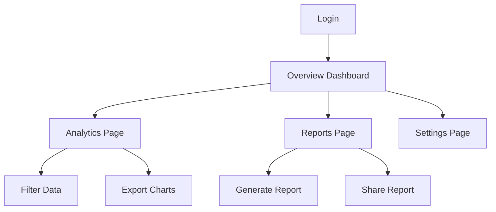

## 1. Product Overview
A modern analytics dashboard with dark theme, card-based layout, and subtle glow accents. The dashboard provides data visualization and metrics tracking with a polished, professional interface.

## 2. Core Features

### 2.1 User Roles
| Role | Registration Method | Core Permissions |
|------|---------------------|------------------|
| Admin | Email registration | Full dashboard access, user management |
| Analyst | Admin invitation | View analytics, create reports |
| Viewer | Admin invitation | Read-only access to assigned dashboards |

### 2.2 Feature Module
The dashboard consists of the following main pages:
1. **Overview Dashboard**: Main metrics display, charts, and KPI cards
2. **Analytics Page**: Detailed data analysis with filters and visualizations
3. **Reports Page**: Report generation and management
4. **Settings Page**: User preferences and system configuration

### 2.3 Page Details
| Page Name | Module Name | Feature description |
|-----------|-------------|---------------------|
| Overview Dashboard | Header Section | Search functionality, theme toggle, notifications, user avatar |
| Overview Dashboard | Sidebar Navigation | Collapsible menu with main sections and manage sections |
| Overview Dashboard | Tab Controls | Pill-shaped tabs for Overview, Activity, Segments, Settings |
| Overview Dashboard | Filter Chips | Status-based filtering with color-coded dots |
| Overview Dashboard | Metric Cards | Display KPIs with numerical values and trend indicators |
| Overview Dashboard | Chart Cards | Large charts for primary metrics visualization |
| Overview Dashboard | Recent Items List | Compact list with status dots and values |
| Analytics Page | Data Filters | Date range picker, category filters, export options |
| Analytics Page | Charts Grid | Multiple chart types with interactive elements |
| Reports Page | Report Generator | Create custom reports with drag-and-drop interface |
| Reports Page | Report Library | View, edit, and share generated reports |
| Settings Page | User Profile | Update personal information and preferences |
| Settings Page | System Settings | Configure dashboard appearance and data sources |

## 3. Core Process
**User Flow:**
1. User logs in and lands on Overview Dashboard
2. User can navigate between different sections using sidebar
3. User filters data using tab controls and filter chips
4. User interacts with cards to view detailed metrics
5. User can export data or generate reports

## 4. User Interface Design

### 4.1 Design Style
- **Colors**: Dark theme with #0f1117 background, #141a21 surfaces, #1c222b elevated cards
- **Accents**: Green (#54e4a6), Blue (#5ac8fa), Orange (#ffbd59), Red (#ff5f6d)
- **Typography**: Inter font family, 600 weight headings, 500 labels, 400 body text
- **Layout**: Card-based with 24px grid gaps, rounded corners (10-18px radius)
- **Effects**: Subtle glows on active elements, soft shadows on cards

### 4.2 Page Design Overview
| Page Name | Module Name | UI Elements |
|-----------|-------------|-------------|
| Overview Dashboard | Header | Brand logo left, search center (420px width), action buttons right |
| Overview Dashboard | Sidebar | 272px fixed width, collapsible, pill-shaped active items with glow |
| Overview Dashboard | Content Grid | 12-column grid, cards span 3-6 columns, 24px gaps |
| Overview Dashboard | Cards | 14px border radius, 1px borders, soft shadows, hover effects |
| Analytics Page | Chart Container | Full-width cards with interactive tooltips |
| Reports Page | Report Cards | Medium size cards with preview thumbnails |
| Settings Page | Form Cards | Clean input fields with focus glow effects |

### 4.3 Responsiveness
- **Desktop-first**: 12-column grid layout for desktop
- **Tablet**: 2-3 column grid adaptation
- **Mobile**: Single column stacked cards
- **Touch optimization**: Larger tap targets on mobile devices