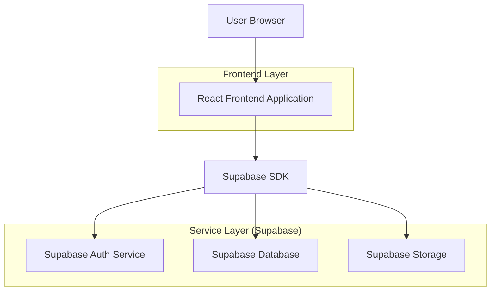
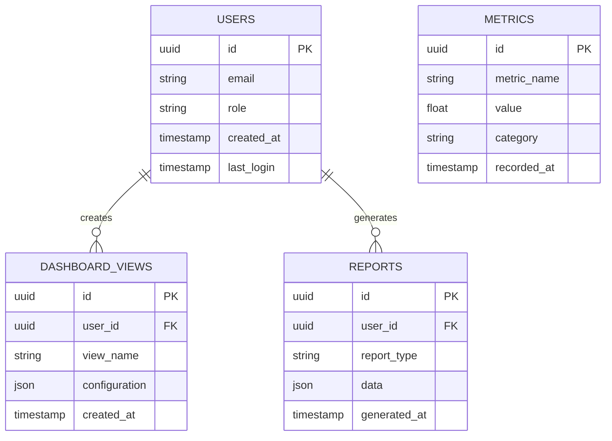

## 1. Architecture Design



## 2. Technology Description
- **Frontend**: React@18 + TailwindCSS@3 + Vite
- **Initialization Tool**: vite-init
- **Backend**: Supabase (Authentication, Database, Storage)
- **UI Components**: Custom components with CSS variables for theming
- **Charts**: Chart.js or Recharts for data visualization

## 3. Route Definitions
| Route | Purpose |
|-------|---------|
| / | Overview Dashboard - Main metrics and KPIs |
| /analytics | Analytics Page - Detailed data analysis |
| /reports | Reports Page - Report generation and management |
| /settings | Settings Page - User preferences and configuration |
| /login | Login Page - User authentication |
| /register | Register Page - User registration |

## 4. API Definitions

### 4.1 Authentication APIs
```
POST /api/auth/login
```

Request:
| Param Name | Param Type | isRequired | Description |
|------------|------------|------------|-------------|
| email | string | true | User email address |
| password | string | true | User password |

Response:
| Param Name | Param Type | Description |
|------------|------------|-------------|
| user | object | User data including id, email, role |
| session | object | Authentication session token |

### 4.2 Dashboard APIs
```
GET /api/dashboard/metrics
```

Response:
| Param Name | Param Type | Description |
|------------|------------|-------------|
| metrics | array | Array of metric objects with name, value, trend |
| lastUpdated | timestamp | Last update timestamp |

## 5. Data Model

### 5.1 Database Schema


### 5.2 Data Definition Language
```sql
-- Users table
CREATE TABLE users (
  id UUID PRIMARY KEY DEFAULT gen_random_uuid(),
  email VARCHAR(255) UNIQUE NOT NULL,
  password_hash VARCHAR(255) NOT NULL,
  role VARCHAR(20) DEFAULT 'viewer' CHECK (role IN ('admin', 'analyst', 'viewer')),
  created_at TIMESTAMP WITH TIME ZONE DEFAULT NOW(),
  last_login TIMESTAMP WITH TIME ZONE,
  updated_at TIMESTAMP WITH TIME ZONE DEFAULT NOW()
);

-- Dashboard views table
CREATE TABLE dashboard_views (
  id UUID PRIMARY KEY DEFAULT gen_random_uuid(),
  user_id UUID REFERENCES users(id) ON DELETE CASCADE,
  view_name VARCHAR(100) NOT NULL,
  configuration JSONB NOT NULL,
  created_at TIMESTAMP WITH TIME ZONE DEFAULT NOW(),
  updated_at TIMESTAMP WITH TIME ZONE DEFAULT NOW()
);

-- Metrics table
CREATE TABLE metrics (
  id UUID PRIMARY KEY DEFAULT gen_random_uuid(),
  metric_name VARCHAR(100) NOT NULL,
  value DECIMAL(10,2) NOT NULL,
  category VARCHAR(50) NOT NULL,
  recorded_at TIMESTAMP WITH TIME ZONE DEFAULT NOW()
);

-- Reports table
CREATE TABLE reports (
  id UUID PRIMARY KEY DEFAULT gen_random_uuid(),
  user_id UUID REFERENCES users(id) ON DELETE CASCADE,
  report_type VARCHAR(50) NOT NULL,
  data JSONB NOT NULL,
  generated_at TIMESTAMP WITH TIME ZONE DEFAULT NOW()
);

-- Create indexes
CREATE INDEX idx_users_email ON users(email);
CREATE INDEX idx_dashboard_views_user_id ON dashboard_views(user_id);
CREATE INDEX idx_metrics_category ON metrics(category);
CREATE INDEX idx_metrics_recorded_at ON metrics(recorded_at DESC);
CREATE INDEX idx_reports_user_id ON reports(user_id);

-- Grant permissions
GRANT SELECT ON users TO anon;
GRANT ALL PRIVILEGES ON users TO authenticated;
GRANT SELECT ON dashboard_views TO anon;
GRANT ALL PRIVILEGES ON dashboard_views TO authenticated;
GRANT SELECT ON metrics TO anon;
GRANT ALL PRIVILEGES ON metrics TO authenticated;
GRANT SELECT ON reports TO anon;
GRANT ALL PRIVILEGES ON reports TO authenticated;
```

## 6. Component Structure

### 6.1 Core Components
- **DashboardLayout**: Main layout with header, sidebar, and content area
- **MetricCard**: Display individual KPIs with trend indicators
- **ChartCard**: Container for charts with title and actions
- **FilterChip**: Pill-shaped filter buttons with status dots
- **SidebarNav**: Collapsible navigation with active state glow
- **DataTable**: Compact list display with hover effects

### 6.2 Styling Approach
- CSS custom properties for design tokens
- TailwindCSS for utility classes
- Component-scoped styles for complex interactions
- Responsive design with mobile-first approach